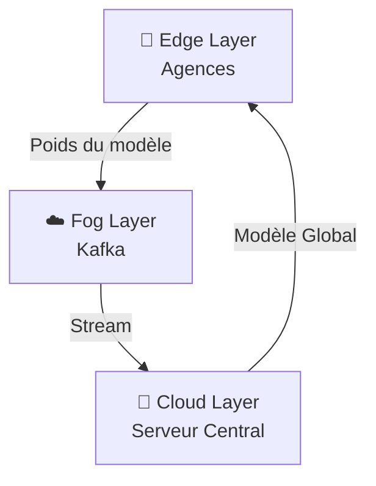

<div align="center">

# 🛡️ Système de Détection de Fraude Bancaire Distribué


**Architecture Edge Computing & Federated Learning pour la détection de fraude**  
*Mobile Money • Bankily • Masrivi • Mauritanie*

[📖 Documentation](#-table-des-matières) • [🚀 Installation](#-installation-et-utilisation) • [📊 Résultats](#-résultats)

</div>

---

## 📑 Table des Matières

- [🧐 Contexte et Problématique](#-contexte-et-problématique)
- [🏗 Architecture Technique](#-architecture-technique)
  - [Edge Layer (Les Agences)](#1-edge-layer-les-agences-)
  - [Fog Layer (Le Transport)](#2-fog-layer-le-transport-)
  - [Cloud Layer (Le Cerveau)](#3-cloud-layer-le-cerveau-)
- [🚀 Installation et Utilisation](#-installation-et-utilisation)
- [📊 Résultats](#-résultats)

---

## 🧐 Contexte et Problématique

Les systèmes centralisés classiques **("Code-to-Data")** posent des risques de sécurité majeurs et violent souvent les régulations de confidentialité (BCM). 

Ce projet adopte l'approche **"Data-to-Code"** :
```
┌─────────────────────────────────────────────────────────┐
│  1. Les données restent dans l'agence (Edge)            │
│  2. Le code se déplace vers les données pour entraîner  │
│  3. Seuls les poids mathématiques sont partagés         │
└─────────────────────────────────────────────────────────┘
```

> **🎯 Objectif :** Créer un modèle d'IA global sans jamais déplacer les données privées des clients hors des agences locales.

---

## 🏗 Architecture Technique

Le système repose sur **trois couches logiques** :

<div align="center">


</div>

### 1. Edge Layer (Les Agences) 🏦

| Composant | Détail |
|-----------|--------|
| **Technologie** | Python, Scikit-learn |
| **Rôle** | Entraînement local des modèles `LogisticRegression` |
| **Confidentialité** | ✅ Aucune donnée brute (CSV) ne sort du conteneur Docker |

### 2. Fog Layer (Le Transport) ☁️

| Composant | Détail |
|-----------|--------|
| **Technologie** | Apache Kafka, Zookeeper |
| **Rôle** | Decoupling et buffering des mises à jour |
| **Garantie** | ✅ Aucune perte de données, même si le serveur est hors ligne |

### 3. Cloud Layer (Le Cerveau) 🧠

| Composant | Détail |
|-----------|--------|
| **Technologie** | Python (Custom Aggregator) |
| **Algorithme** | `FedAvg` (Federated Averaging) |
| **Rôle** | Agrégation des poids → Modèle National |

---

## 🚀 Installation et Utilisation

### Prérequis
```bash
✓ Docker & Docker Compose
✓ Python 3.8+
```

### Démarrage Rapide (Simulation)

#### **Étape 1 : Lancer l'infrastructure**
```bash
docker-compose up -d
```
> Lance Kafka & Zookeeper en arrière-plan

#### **Étape 2 : Démarrer le Serveur Central**
```bash
python cloud_server.py
```
> Le serveur se met en mode écoute sur le topic `fraud-model-updates`

#### **Étape 3 : Lancer les Nœuds Edge**

Dans de nouveaux terminaux, simulez les agences :
```bash
# Terminal 1 - Agence 1
python edge_node.py 1

# Terminal 2 - Agence 2
python edge_node.py 2

# Terminal 3 - Agence 3
python edge_node.py 3
```

<div align="center">

**⚡ Le système commence automatiquement l'apprentissage fédéré !**

</div>

---

## 📊 Résultats

<div align="center">

| Métrique | Valeur | Description |
|----------|--------|-------------|
| **Précision Globale** | `61.48%` | Après agrégation des connaissances de 3 agences |
| **Confidentialité** | `100%` | ✅ Aucune fuite de données (Data Leakage) |
| **Résilience** | `Haute` | ✅ Fonctionne même avec une agence déconnectée |

</div>


</div>
